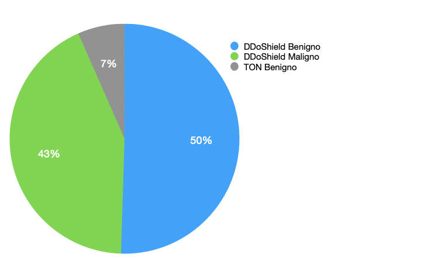
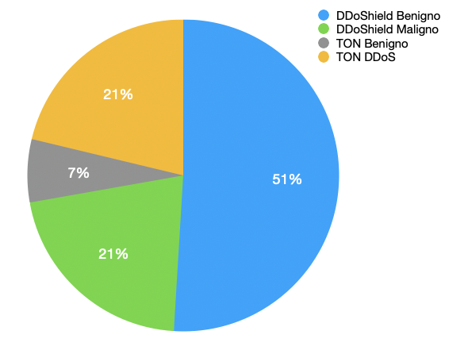
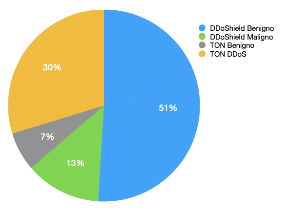
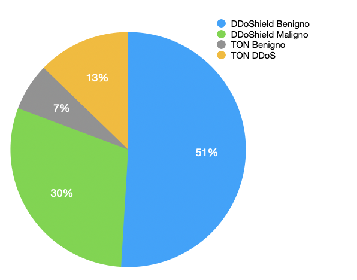
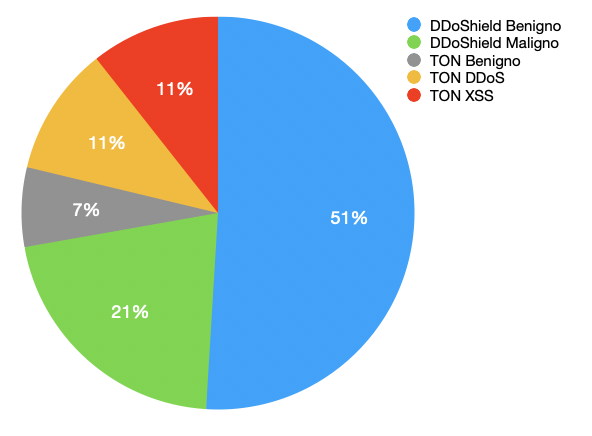

# Dataset Generation for IDS Training - Thesis Project

This repository contains the code and datasets used in my thesis titled **"Strategy for Optimizing IDS Training through Data Augmentation"**. The primary focus of this work is to enhance the training of Intrusion Detection Systems (IDS) by generating diverse datasets and applying data augmentation techniques. These datasets are used to evaluate the performance of several machine learning algorithms, including K-Means, Random Forest (RF), and Convolutional Neural Networks (CNN).

## Table of Contents

- [Overview](#overview)
- [Datasets](#datasets)
  - [Dataset Composition](#dataset-composition)
  - [Dataset Generation](#dataset-generation)
- [License](#license)
- [Acknowledgments](#acknowledgments)

## Overview

In this project, we generated multiple datasets to train and evaluate IDS models using a combination of benign and malicious traffic from various sources. The datasets include traffic from **DDOShield** and **TON**, with both benign and malicious samples. Additionally, we analyzed the effect of removing the simulator's contribution and relying solely on **TON** data for further evaluation.

## Datasets

### Dataset Composition

Five main datasets were created using different combinations of benign and malicious traffic:

- **DATASET1**: 
  - Benign traffic: DDOShield + TON
  - Malicious traffic: DDOShield (Malicious)
  
    

- **DATASET2**: 
  - Benign traffic: DDOShield + TON
  - Malicious traffic: 50% DDOShield + 50% TON DDOS
  
    

- **DATASET3**: 
  - Benign traffic: DDOShield + TON
  - Malicious traffic: 70% DDOShield + 30% TON DDOS
  
    

- **DATASET4**: 
  - Benign traffic: DDOShield + TON
  - Malicious traffic: 30% DDOShield + 70% TON DDOS
  
    

- **DATASET5**: 
  - Benign traffic: DDOShield + TON
  - Malicious traffic: 50% DDOShield + 50% TON, divided into 25% XSS and 25% DDOS
  
    

### Dataset Generation

First, the TON dataset requires an initial preprocessing phase consisting of two steps: 
1. Add the destination address of our server within the simulator architecture (10.0.0.1). For malicious packets, also change the source port to 9. You can do this by running the script `preparePcap/addServerAddress.py` and setting "benign" flag.
2. The packets in the dataset lack a proper forwarding header. To allow Wireshark to display them correctly during forwarding, you need to run the `preparePcap/modifyPcap.py` script, which adds the correct headers.

To generate **Dataset1**, follow these steps:

1. Download the simulator from the link below.
2. In the `docker/TServer/` directory:
   - Replace the `Dockerfile` with the one uploaded in the `replay` folder of this repository.
   - Add `replay/replayBenignOnly.py` and the `.pcap` file to replicate.
3. Start the simulator:
   - Create the desired number of nodes (refer to the simulator documentation):
     ```bash
     ./main.py -d 3 create
     ```
   - Start packet capture:
     ```bash
     ./main.py -d 3 nsr -l 1
     ```
   - Open the shell:
     ```bash
     docker exec -it emu1 bash
     ```
   - Run the benign traffic replay script:
     ```bash
     python3 ./replayBenignOnly.py
     ```

Now that **Dataset1** is generated correctly, it can be split into parts to generate other scenarios offline or create new ones. To do this:
Run the script `train/splitTraffic.py` which will split the traffic into benign and malicious portions, and combine the resulting portions using the command `mergecap`.

Example:
```bash
mergecap -w outputFile.pcap benign1.pcap malicious1.pcap maliciousTon.pcap
```

You can explore the generated datasets in the `datasets/` folder.
## License

This project is licensed under the MIT License - see the [LICENSE](LICENSE) file for details.

## Acknowledgments

Special thanks to the creators of the **DDOShield** and **TON** datasets, as well as the contributors to open-source libraries that made this work possible.

- https://github.com/iobaidat/DDoShield-IoT
- https://research.unsw.edu.au/projects/toniot-datasets
